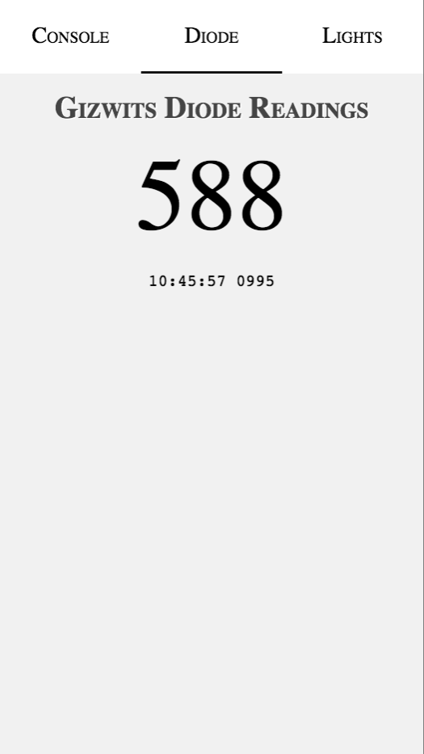
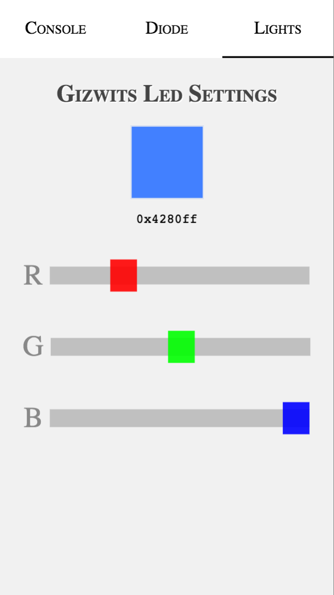

This is a captive application demo for the ESP8266 / [Gizwits](https://gregwareblog.wordpress.com/2016/01/10/esp-witty/) module

# Captive Application

The idea is to use an ESP8266 as an access point, to which, when logged in, users can start a standalone web application and interact (via web-sockets) with the ESP as well as other devices connected to the same ESP.

By nature, a captive application is a web application which runs in the captive portal. In iOS, it can only run in the captive portal if the ESP does not have any Internet connection.

# Installation

	make install
	make build
	make upload

or just `make`

# Customisation

Once the application MCU code is uploaded to the ESP, the web application code can be built and uploaded separately from the MCU code.

	cd web
	make build
	make upload

# Screen shots

